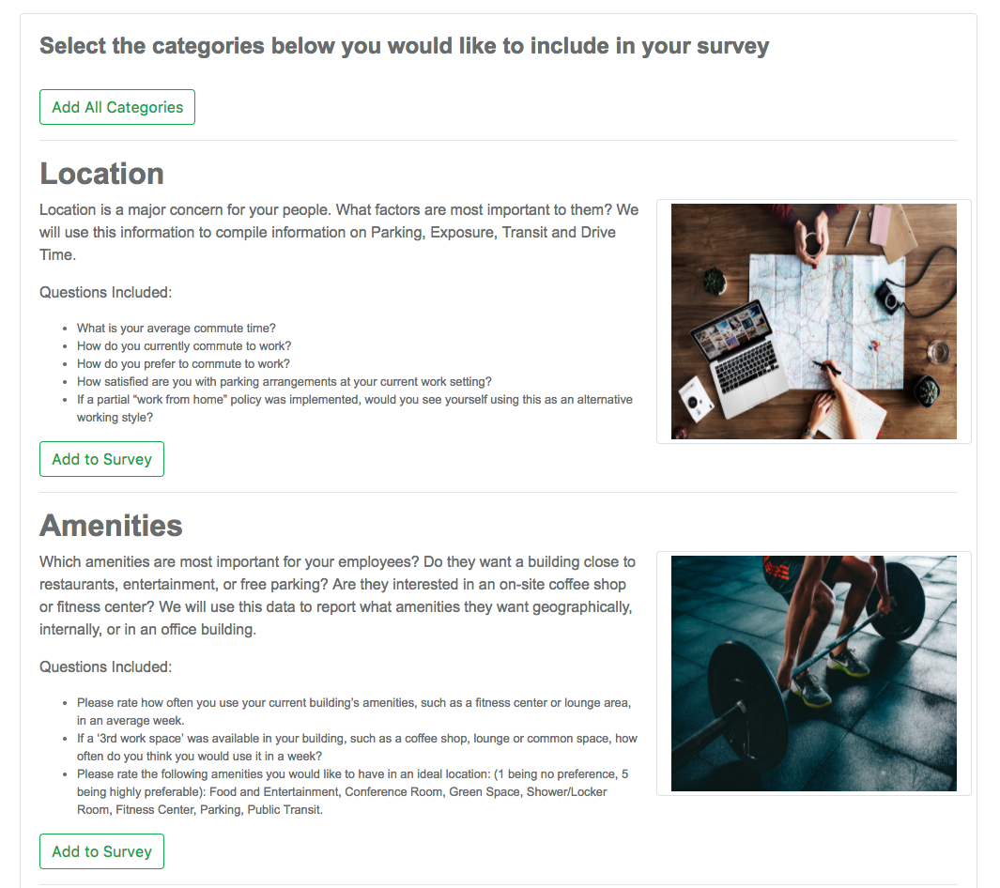
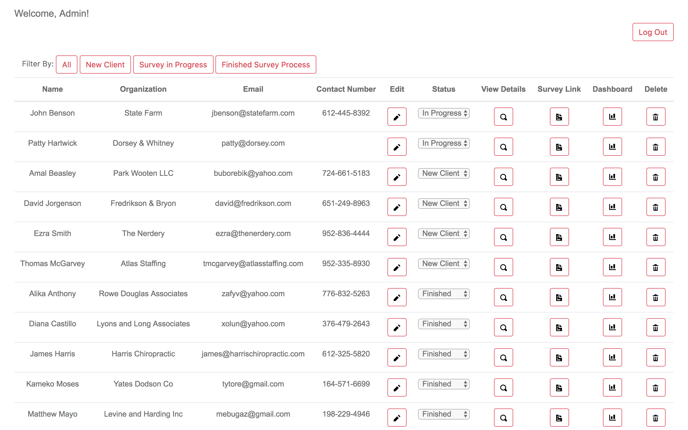

                                                                                                                                                                                    
88888888ba,   88                                                                        88b           d88                88888888ba                                    88           
88      `"8b  ""                                                                        888b         d888                88      "8b                                   88           
88        `8b                                                                           88`8b       d8'88                88      ,8P                                   88           
88         88 88 ,adPPYYba,  ,adPPYb,d8 8b,dPPYba,   ,adPPYba,  ,adPPYba,  ,adPPYba,    88 `8b     d8' 88 8b       d8    88aaaaaa8P' ,adPPYba,  ,adPPYba,  8b,dPPYba,  88  ,adPPYba,
88         88 88 ""     `Y8 a8"    `Y88 88P'   `"8a a8"     "8a I8[    "" a8P_____88    88  `8b   d8'  88 `8b     d8'    88""""""'  a8P_____88 a8"     "8a 88P'    "8a 88 a8P_____88
88         8P 88 ,adPPPPP88 8b       88 88       88 8b       d8  `"Y8ba,  8PP"""""""    88   `8b d8'   88  `8b   d8'     88         8PP""""""" 8b       d8 88       d8 88 8PP"""""""
88      .a8P  88 88,    ,88 "8a,   ,d88 88       88 "8a,   ,a8" aa    ]8I "8b,   ,aa    88    `888'    88   `8b,d8'      88         "8b,   ,aa "8a,   ,a8" 88b,   ,a8" 88 "8b,   ,aa
88888888Y"'   88 `"8bbdP"Y8  `"YbbdP"Y8 88       88  `"YbbdP"'  `"YbbdP"'  `"Ybbd8"'    88     `8'     88     Y88'       88          `"Ybbd8"'  `"YbbdP"'  88`YbbdP"'  88  `"Ybbd8"'
                             aa,    ,88                                                                       d8'                                          88                       
                              "Y8bbdP"                                                                       d8'                                           88  

# Cushman & Wakefield: Diagnose My People
Diagnose My People is a full stack web application that helps Cushman & Wakefield clients/decision makers survey their people and tabulate their feedback into visualized data that is used to make informed decisions in purchasing a new workspace.  Clients of Cushman & Wakefield can go to the website and are provided with the opportunity to build a custom-tailored survey that is used to gather employee data on the categories that matter to them.  Once the survey has been created, Cushman & Wakefield will reach out to the clients and provide them with a custom URL and passcode for the survey that the client will email their employees.  When the survey period is over, the data is compiled into an eye-catching and user-friendly dashboard.  Cushman & Wakefield uses this information to better serve and make recommendations to clients and show them properties that resemble what the survey suggests.  This results in happier people with more buy-in and loyalty to their employer.  

# Built With
- PostgreSQL
- AngularJS
- Express
- Node.js
- Charts.js
- AngularJS RZ Slider
- FileStack
- Bootstrap
- OpenIconic

# Getting Started
These instructions will get you a copy of the project up and running on your local machine for development and testing purposes. See deployment for notes on how to deploy the project on a live system.

# Prerequisites
Link to software that is required to install the app (e.g. node).

- Node.js
- npm
- PostgreSQL
- homebrew

# Installing
Steps to get the development environment running.

1. npm install
2. Create SQL database diagnose_my_people
3. Execute SQL query in database.sql to create database structure.
4. npm start

# Screen Shots






# Scoping Documentation
https://docs.google.com/document/d/1G6ohnimZbsAvzyrfVTBZW5oinIJzukz1kAIoOEHAey8/edit?usp=sharing

# Completed Features

[ X ] Landing Page - Feature-Description Summary of ‘Build Your Own Survey’ Tool

[ X ] Landing Page - Preview Sample Question 

[ X ] Landing Page - Feature-Description Summary of Create Your Own Survey Tool

[ X ] Landing Page - Feature-Preview Teaser of Sample Data Dashboard

[ X ] Customize a Survey - Feature-Multipage form of checkboxes to select individual questions for survey

[ X ] Customize a Survey - Feature Form to fill out contact information.

[ X ] Admin View Page - Feature-table of clients who have created custom surveys, shows status of new, survey in progress/completed Survey, Survey Process Finished

[ X ] Admin View Page - Feature-Button to navigate to view to click to review and edit surveys and approve them to be sent out

[ X ] Survey Review View - Feature-Table of all selected questions and ability to write blurb and save

[ X ] Survey Review View - Feature-View of Company URL and PassCode

[ X ] Survey View - Feature-Landing page for survey

[ X ] Survey View - Feature-Stylized questions built off nature of question

[ X ] Survey View - Feature-Personalized Company Header Text noting which businesses survey is for.

[ X ] Admin Dashboard View - Feature-KPI Get Requests for each section

[ X ] Admin Dashboard View - Feature-Get Data to be visual pleasing and story based within each KPI

[ X ] Admin Dashboard View - Feature-Charts

[ X ] Admin Dashboard View - Feature-Text Summaries of Responses

[ X ] Admin Dashboard View - Feature-Admin add blurbs with recommendations for each KPI


# Next Steps
Features that you would like to add at some point in the future.

[  ] Admin Dashboard View - Feature- Comment Section connect
[  ] Admin Dashboard View - Feature-Heatmaps

### Adding a Map Feature to Diagnose My People:

Get a Google Maps API key for Cushman & Wakefield. Follow the link below.
https://developers.google.com/maps/documentation/javascript/get-api-key

Add Google Maps API using the Database method to save user information.
The link below is a step-by-step tutorial. This link will also give instruction on creating a new SQL table, which will need to be JOINED with the client table.
https://developers.google.com/maps/documentation/javascript/info-windows-to-db

It is recommended to place the Map display in the survey.html view above the first          ng-repeat.

The results will need a GET request to display on the dashboard. Google Maps API can display the results in a heatmap. The link below details heatmaps and other ways to display the data.
https://developers.google.com/maps/documentation/javascript/earthquakes

# Heroku Deployment

[Heroku](https://www.heroku.com/) is a Cloud Application Platform that allows users to publishapps to the web.

## Summary Steps

### Heroku Prerequisite

1. Sign up for an account on [Heroku.com](https://www.heroku.com/)
2. Install Heroku CLI by typing `brew install heroku` in Terminal
3. Authenticate by typing `heroku login` in Terminal

> Note: Your project also needs to have a git repository.

### Heroku Setup

Before you deploy, make sure your server `port` is configured correctly as:

```JavaScript
var port = process.env.PORT || 5000;
```

Run the following commands from within your project folder.

1. In terminal, navigate to your project folder and type `heroku create`
2. Login in if prompted
3. Type `git remote -v` to ensure it added successfully
4. In terminal, type `git push heroku master`
5. Our website is now live! However... we also have a database

### Postgresql on Heroku

1. In terminal, type `heroku addons:create heroku-postgresql:hobby-dev` to set up Postgresql on your Heroku project
2. Next, type `heroku pg:push your_database DATABASE_URL` to copy your database contents up to Heroku. `your_database` is the actual name of your database (e.g. `koala_holla_`). `DATABASE_URL` is a heroku config variable created by the Add On. Do not replace it with something else, just type: `DATABASE_URL`. For example, if you were deploying the `koala_holla` database, you should type `heroku pg:push kaola_holla DATABASE_URL`
3. Update or create a module for your pg-pool configuration to the following code that will convert the heroku `DATABASE_URL` into a pool config object. The only line you should have to change is `database: process.env.DATABASE_NAME || 'your_database'`. Change `your_database` to the actual name of your database. (e.g. `database: process.env.DATABASE_NAME || 'koala_holla'`:

**modules/pool.js**

```JavaScript
/**
* You'll need to use environment variables in order to deploy your
* pg-pool configuration to Heroku.
* It will look something like this:
**/

var pg = require('pg');
var url = require('url');
var config = {};

if (process.env.DATABASE_URL) {
  // Heroku gives a url, not a connection object
  // https://github.com/brianc/node-pg-pool
  var params = url.parse(process.env.DATABASE_URL);
  var auth = params.auth.split(':');

  config = {
    user: auth[0],
    password: auth[1],
    host: params.hostname,
    port: params.port,
    database: params.pathname.split('/')[1],
    ssl: true, // heroku requires ssl to be true
    max: 10, // max number of clients in the pool
    idleTimeoutMillis: 30000, // how long a client is allowed to remain idle before being closed
  };

} else {
  // only change the things on the right side of the ||
  config = {
    user: process.env.PG_USER || null, //env var: PGUSER
    password: process.env.DATABASE_SECRET || null, //env var: PGPASSWORD
    host: process.env.DATABASE_SERVER || 'localhost', // Server hosting the postgres database
    port: process.env.DATABASE_PORT || 5432, //env var: PGPORT
    database: process.env.DATABASE_NAME || 'your_database', //env var: PGDATABASE or the name of your database (e.g. database: process.env.DATABASE_NAME || 'koala_holla',)
    max: 10, // max number of clients in the pool
    idleTimeoutMillis: 30000, // how long a client is allowed to remain idle before being closed
  };
}

module.exports = new pg.Pool(config);
```

When you need a pool, use the following code:

```JavaScript
var pool = require('../modules/pool.js');
```

Next, commit your changes and push them to Heroku:

```
git add .
git commit -m "MESSAGE"
git push heroku master
```

> Note: You'll need to commit and push each time you make a change that you want to deploy to Heroku. Automatic deployments are covered in [a later section](#gui-and-automatic-deployment) **Keep in mind you CAN NOT pull from Heroku. This is not a replacement for GitHub!**

Lastly, open terminal and type `heroku open`, which should show you your deployed site!

> Note: It is best to fully test your code locally before deploying to Heroku. Bugs are much harder to troubleshoot on a live website.

### Miscellaneous

- `heroku logs` - Display error logs
- `heroku config` - Show basic app info
- `heroku restart` - Sometimes it helps to turn things off an on again
- `heroku open` - Opens the website for you project in the browser

## GUI and Automatic Deployment

The [Heroku](https://www.heroku.com/) website GUI can simplify several of the steps taken above especially for projects where you intend to make future changes.

1. In [your list of Heroku apps](https://dashboard.heroku.com/apps), select your application.
2. Under the `Deploy` tab, in the `Deployment Method` section, select `Github`. Connect to the `Github` repository with your application by searching for the name of your repository.
3. In the `Manual Deploy` section, click `Deploy Branch` to deploy for the first time.

## Connect Postico to your Heroku Database

If you would like to edit  database, connect to your Heroku database directly from Postico. 

1. In [your list of Heroku apps](https://dashboard.heroku.com/apps), select your application.
2. Under `Resources` or in the `Configure Add-Ons` section, select `Heroku Postgres`.
3. Select the `Settings` tab and click `View Credentials`
4. Open Postico and select `New Favorite`.
5. In the new Postico favorite, update the following to match Heroku:
  - Host
  - User
  - Database
  - Password
  - Port
6. Click `Connect` and you should have access to your database directly from Postico!

## Resources

More detailed instructions can be found here: 

- Deployment Videos [https://drive.google.com/drive/u/1/folders/0B9sCDSmGi72ZN2hpR1Etbl9qb2c](https://drive.google.com/drive/u/1/folders/0B9sCDSmGi72ZN2hpR1Etbl9qb2c)
- [https://devcenter.heroku.com/articles/git](https://devcenter.heroku.com/articles/git)
- [https://devcenter.heroku.com/articles/heroku-postgresql](https://devcenter.heroku.com/articles/heroku-postgresql)

# Authors
Dave Clark, Ryan DeCook, Joe Wales, Brandon Yapel
